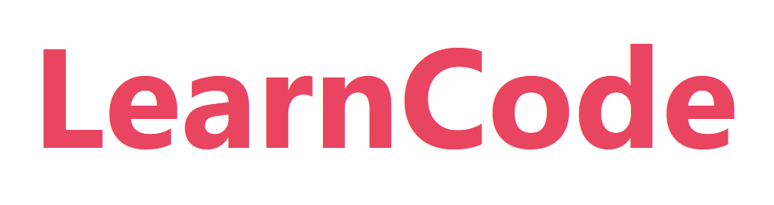
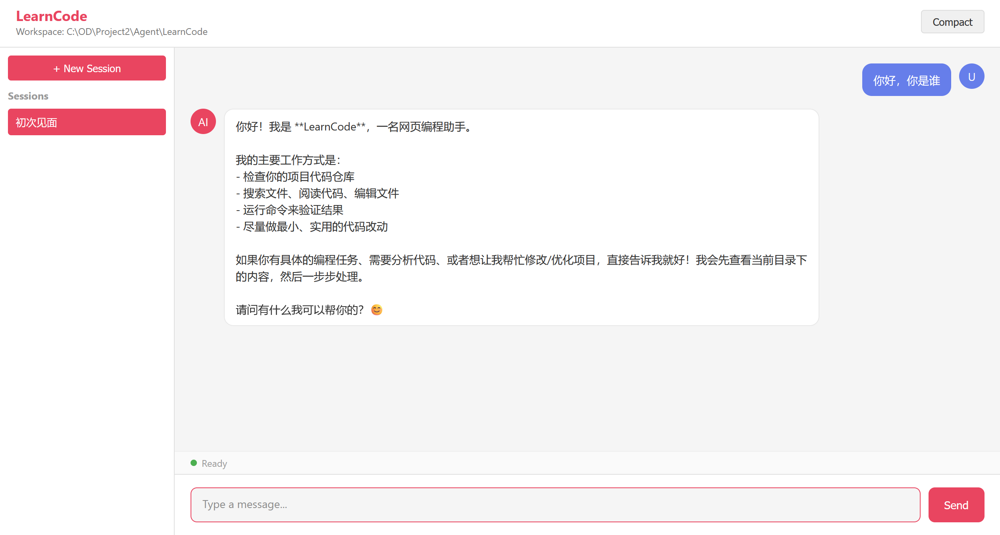
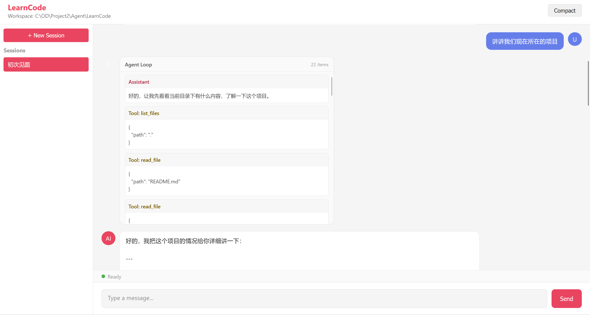

<p align="center">
  
</p>

[English](README.en.md)

LearnCode 是一个使用 Python 编写的轻量 coding agent 学习项目，并提供 Web 前端。

这个项目用于学习 agent loop 的基本结构：浏览器把用户消息发给 Python 后端，后端请求模型，按模型要求执行工具，保存 session，并通过 WebSocket 把中间步骤推送回页面。





## 启动方法

- Python 3.10 或更新版本。
- 可用的模型接口和 API key。

安装依赖：

```powershell
cd LearnCode
pip install -r requirements.txt
```

在 `.env` 里配置模型。

Anthropic 风格接口：

```env
LEARN_CODE_MODEL=claude-3-5-sonnet-latest
LEARN_CODE_ANTHROPIC_BASE_URL=https://api.anthropic.com/v1/messages
LEARN_CODE_API_KEY=your-api-key
```

OpenAI-compatible 接口：

```env
LEARN_CODE_MODEL=deepseek-chat
LEARN_CODE_OPENAI_BASE_URL=https://api.deepseek.com/v1/chat/completions
LEARN_CODE_API_KEY=your-api-key
```

其他可选配置：

```env
LEARN_CODE_MAX_OUTPUT_TOKENS=4096
LEARN_CODE_MAX_RETRIES=4
WORKSPACE=C:\path\to\your\workspace
HOST=127.0.0.1
PORT=8080
```

如果没有设置 `WORKSPACE`，LearnCode 会使用启动服务器时所在的目录。

启动服务：

```powershell
python -m src.main
```

打开浏览器访问：

```text
http://127.0.0.1:8080
```

## 使用方式

在网页输入消息并发送。LearnCode 会创建或复用 session，请求已配置的模型，把工具调用显示在 Agent Loop 区块里，并把对话保存到 `.sessions`。

Compact 按钮会把当前会话较早的上下文总结成摘要，减少后续模型请求需要携带的内容长度。这个按钮只是可选的手动压缩；即使不点击，后端也会根据上下文长度按规则自动压缩。

## 已实现功能

- 基于 FastAPI 的 Web 对话页面。
- 基于 WebSocket 的 session 事件、agent step、工具调用和最终回复推送。
- Anthropic 风格和 OpenAI-compatible 两类模型适配器。
- 内置编码工具：读取文件、列出文件、搜索文件、编辑文件、写入文件、运行命令。
- agent loop：支持 progress 消息、工具调用、工具结果和最终 assistant 回复。
- JSONL event log 形式的 session 系统，支持列表、加载、保存、删除、重命名、fork、自动生成标题、compact boundary 和过期清理。
- 上下文管理：工具结果限长、microcompact、snip compact、context collapse、auto compact 和 Compact 按钮摘要。
- 通过 `SKILL.md` 发现本地 skill。
- 基础 MCP server 加载和 MCP 工具执行。
- 根据启动目录或 `WORKSPACE` 确定 workspace。

## 致谢

 [LiuMengxuan04/MiniCode](https://github.com/LiuMengxuan04/MiniCode) 
 [QUSETIONS/MiniCode-Python](https://github.com/QUSETIONS/MiniCode-Python)。
